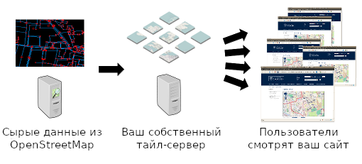

Использовать тайлы стороннего поставщика - это самый простой и быстрый способ перейти на OpenStreetMap, к тому же недорогой. Однако, если вы хотите большего - полного контроля над картами, вы можете генерировать и использовать свои собственные тайлы. В этом разделе рассказывается как это сделать.

# Это точно для вас?

Как для самостоятельной генерации тайлов, так и для их дальнейшего обслуживания, необходимо достаточно мощное оборудование, в особенности если речь идет о планетарных масштабах и регулярных обновлениях. 

Если вы решили запустить свой собственный тайл-сервер, мы рекомендуем использовать для этих целей [Ubuntu Linux](http://www.ubuntu.com/).

# Варианты

1. [Ручная сборка тайл-сервера](manually-building-a-tile-server-18-04-lts/)
2. [Установка тайл-сервера из готового пакета](building-a-tile-server-from-packages/)

# Системные требования
Генерация и обслуживание собственных карт - достаточно ресурсоемкая задача. Системные требования к оборудованию зависят от размера территории, с которой вы решили работать, и трафика, который ожидаете. В целом, для среднего города понадобится 10-20 ГБ памяти на жестком диске, 4 ГБ ОЗУ и современный двухъядерный процессор. Если же вам нужна вся планета, то будьте готовы предоставить минимум 300+ ГБ на жестком диске, 24 ГБ ОЗУ и четырехъядерный процессор.

Мы рекомендуем вам начать генерацию своих тайлов с небольших территорий, например, городов, областей или маленьких стран. Потому что обработка планеты может занять неделю, а если вы допустили ошибку при настройке, вам придется делать все заново. Вы можете скачать выгрузки из базы данных OSM:

* [Geofabrik](http://download.geofabrik.de/osm/) (страны и области)
* [Protomaps Extracts](https://protomaps.com/extracts/) (ежеминутные обновления городов и маленьких стран)

# Инструменты

Мы используем следующие инструменты для генерации и работы с тайлами.

**Apache** - это front-end сервер, который обрабатывает запросы от веб-браузера и передает запрос на mod_tile. Веб-сервер Apache также может использоваться для обслуживания статического веб-контента, такого как HTML, JavaScript или CSS для вашей веб-страницы с картой.

Как только Apache поступает запрос от веб-пользователя, он передает его в mod_tile для обработки. Mod_tile проверяет, создан ли уже запрашиваемый тайл и готов к использованию, или его необходимо обновить, так как он не находится в кэше. Если тайл уже имеется в наличии, то он отправляет его пользователю. Если же тайл нужно заново генерировать, он ставит его в очередь на генерацию. После того, как тайл будет создан, он также отправляет его пользователю.

Для генерации (рендера) тайлов мы используем инструмент под названием **Mapnik**. Когда ему поступает запрос на генерацию тайла, он берет нужную информацию из разных источников, которую необходимо отобразить, и делает тайл. После - передает тайл клиенту и выполняет новое задание из очереди.

Для того, чтобы генерировать (рендерить) тайлы, данные из OpenStreetMap должны храниться в базе данных **PostgreSQL**, созданной инструментом **osm2pgsql**. Эти две составляющих работают вместе, чтобы обеспечить эффективный доступ к геоданным OpenStreetMap. С помощью diff-файлов, которые создаются каждые 60 секунд на главном сервере OpenStreetMap, вы можете обеспечить актуальность данных в своей БД PostgreSQL.
